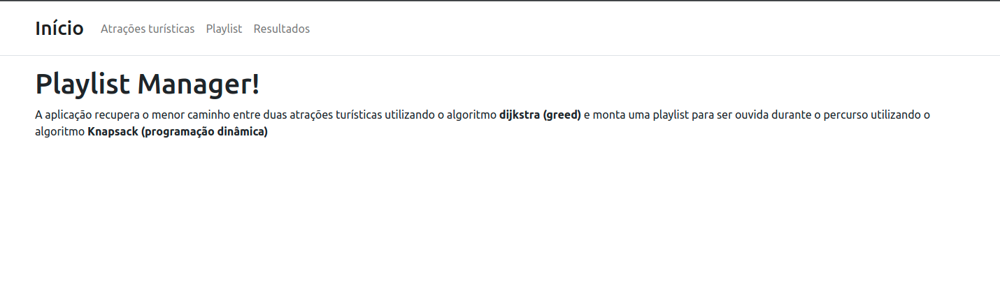
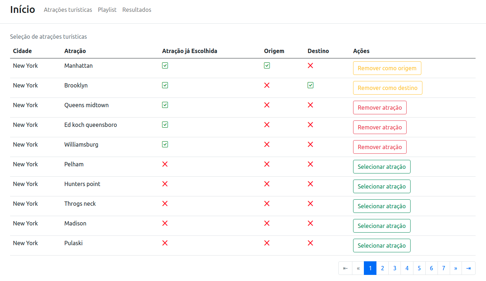
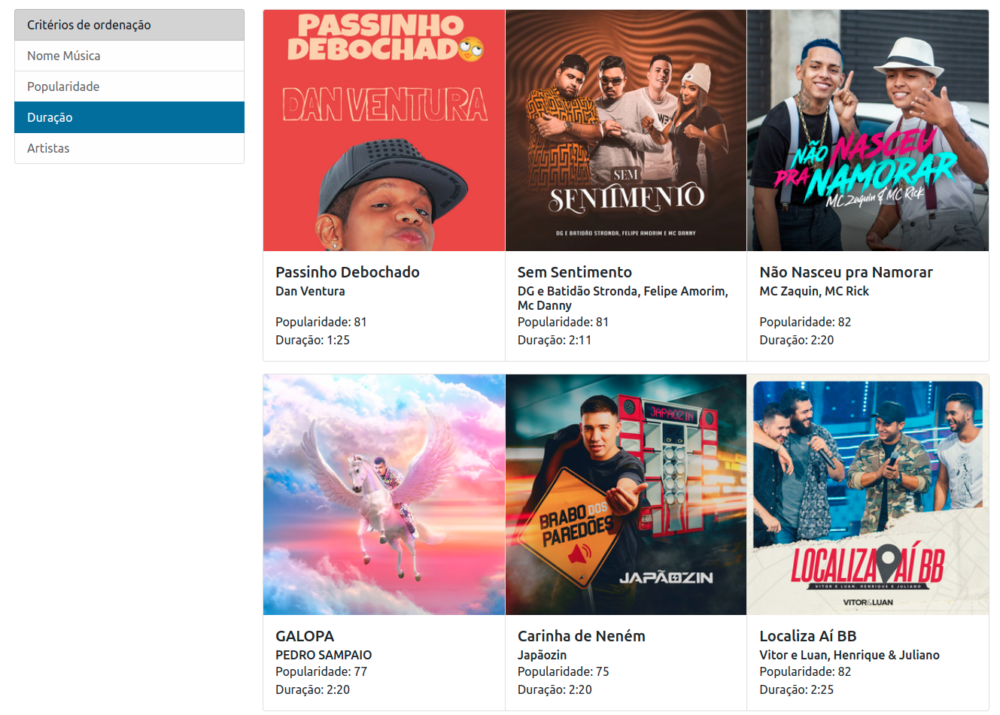
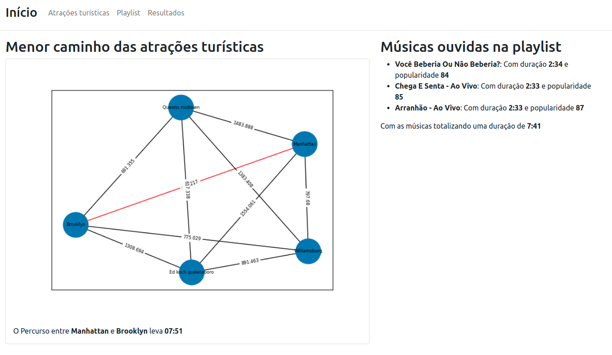

# Final_Travel_Playlist

**Número da Lista**: 2<br>
**Conteúdo da Disciplina**: Final (Dijkstra e Knapsack)<br>

## Alunos
|Matrícula   |               Aluno                  |
| ---------- | ------------------------------------ |
| 15/0132590 |      João Vitor Ramos de Souza       |

## Sobre 

O Travel Playlist tem como objetivo recuperar o menor caminho entre duas atrações turísticas utilizando o algoritmo <strong>dijkstra (greed)</strong> e monta uma playlist para ser ouvida durante o percurso utilizando o algoritmo <strong>Knapsack (programação dinâmica)</strong>. Para recuperar as atrações turísticas foi utilizado um dataset com atrações turísticas de Nova Iorque, incluído no arquivo `dump.zip`, e para o cálculo da distância entre as atrações turísticas foi utilizada a API do Mapbox. Já para utilizar músicas de uma Playlist foi utilizada a API do Spotify.

## Screenshots
1. Página inicial da aplicação
   
2. Atrações turísticas
   
3. Músicas da playlist
   
4. Resultados
   

## Instalação 
**Linguagem**: Python<br>
**Framework**: Django<br>

Pré-requisitos para rodar o **Tourism_Routes**:

É necessário ter o Python (versão 3.8.x), Pip e docker-compose instalados em seu sistema operacional.

Instale as dependências do Python no seu sistema operacional com o seguinte comando:
```sh
$ git clone https://github.com/projeto-de-algoritmos/Grafos2_Tourism_Routes
$ cd Grafos2_Tourism_Routes
$ pip3 install -r requirements.txt
```

Também é necessário ter um banco de dados Postgres sendo executado e para isso foi adicionado o docker-compose para se facilitar a criação do ambiente. Com o docker-compose instalado, basta executar o seguinte comando:

```sh
$ docker-compose up
```

**Importante:** O comando `docker-compose up` irá inutilizar o terminal aberto, para se subir o container do banco de dados em bacground, basta executar o comando `docker-compose up -d`

Realize as migrações do banco de dados com o seguinte comando:
```sh
$ python manage.py migrate
```

Para facilitar a primeira execução do projeto, foi adicionado o arquivo `dump.zip` com um arquivo `json` para carregar o dump de 100 atrações turísticas da cidade de Nova Iorque e músicas da playlist Top 50 Brasil. Extraia o arquivo `dump.zip` e execute os seguintes comandos para carregar o grafo no banco de dados.

Carregando dados:
```sh
$ unzip dump.zip # Comando para extrair arquivos .zip em ambientes linux
$ python manage.py loaddata db_data.json
```

Suba o servidor Django com o comando abaixo:
```sh
$ python manage.py runserver
```

### Token do mapbox

Para as requisições do Mapbox funcionarem corretamente, deve ser gerado um `access_token` ao se cadastrar no [site do Mapbox](https://www.mapbox.com/).

Após finalizar seu cadastro no Mapbox será possível visualizar o seu `access_token`, caso tenha dificuldades acesse essa página de ajuda do Mapbox para maiores informações. Após isso, atualize o [arquivo de configurações](/playlist_manager/settings.py) e substitua o valor da variável `MAPBOX_API_KEY` com o `access_token` do site do Mapbox.

### Configuração do token do Spotify

Para configurar o token do spotify acesse o link da [API de playlists](https://developer.spotify.com/console/get-current-user-playlists/) e selecione opção `Get Token`, na modal de confirmação selecione aperte o botão `Request Token` e aceite os termos para a utilização da API do Spotify.

Com isso, deve ser copiado o Token para o [arquivo de configurações](/playlist_manager/settings.py) e substitua o valor da variável `SPOTIFY_ACCESS_TOKEN`.


## Uso 

1. Com todos os comandos de instalação já executados, abra seu navegador em `http://localhost:8000`
2. Para visualizar as atrações turísticas disponíveis para busca, clique na navbar em **Atrações turísticas** ou acesse a url `http://localhost:8000/attractions/`. Nessa página é possível que se selecione todas as atrações para se traçar o menor caminho entre elas.
3. Para visualizar as músicas da playlist, clique na navbar em **Playlist** ou acesse a url `http://localhost:8000/tracks/`. 
4. Para verificar o menor caminho entre as atrações turísticas e as músicas da Playlist que podem ser escutadas, clique na navbar em **Resultados** ou acesse a url `http://localhost:8000/results/`

## Outros 

### Carregando novas atrações turísticas

Caso não queira utilizar um número maior de atrações turísticas, existe um comando disponível para carregar as atrações turísticas na base de dados. Para executá-lo é necessário rodar o comando:
```sh
$ unzip dump.zip # Comando para extrair arquivos .zip em ambientes linux
$ python manage.py load_tourism_attractions ---qty-attractions=<quantidade de atrações turísticas>
```

### Carregando novas playlists

Caso queira utilizar outra playlist do spotify, existe um comando disponível para carregar músicas de uma playlist. Para executá-lo é necessário rodar o comando:

```sh
$ python manage.py dump_playlist_data --playlist-id=<ID da playlist no spotify>
```

**Observação:** O ID de uma playlist se localiza após ao final da seguinte URL, indicado por `<id_da_playlist>` no exemplo:

`https://open.spotify.com/playlist/<id_da_playlist>`


